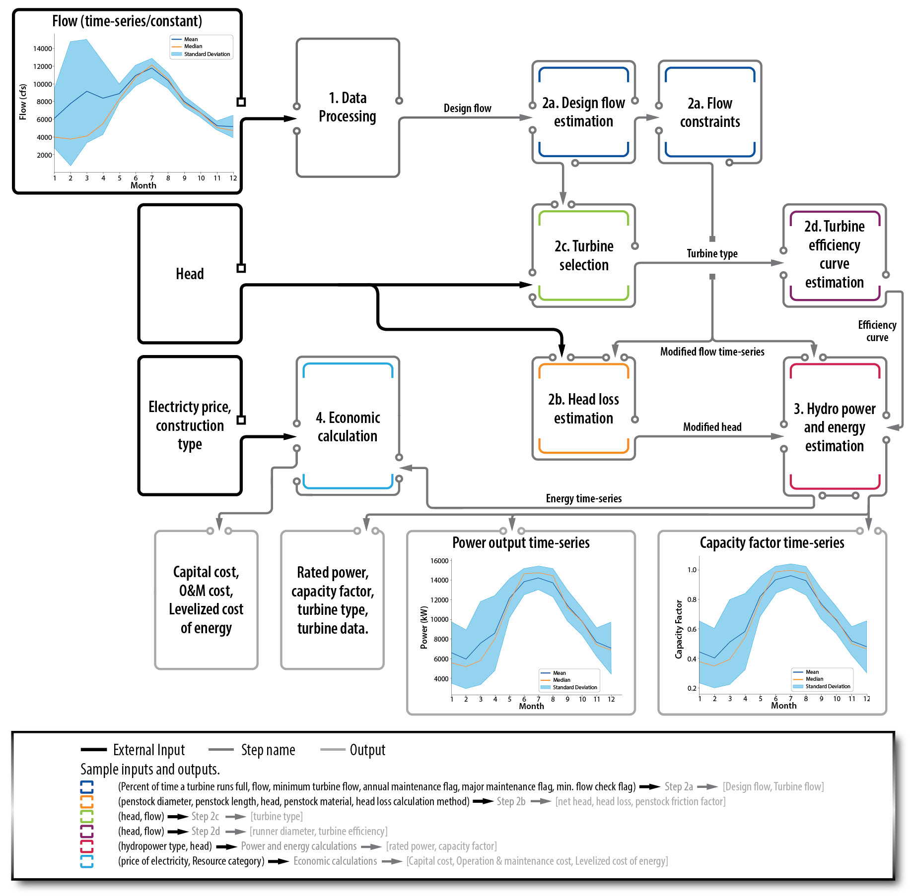

# Summary

Conducting pre-feasibility studies on hydro power sites can be expensive, technically challenging, and time-consuming for a variety of stakeholders from developers to small asset owners. HydroGenerate is an open-source Python library designed to assist hydropower developers and other stakeholders in estimating the generation potential at a user-selected site, while also aiming to reduce the technical and financial burdens associated with the initial pre-feasibility analysis phase. HydroGenerate can help reduce the above-mentioned barriers by providing realistic insights into a site's technical potential and performance. Thereby helping hydropower stakeholders make decisions confidently and move projects forward if feasible. Additionally, HydroGenerate can support researchers in evaluating the potential of new hydropower technologies or plant operating policies. Also, due to the light-weight nature of the tool, HydroGenerate can be used alongside third-party packages to investigate solutions to a variety of other energy system challenges (e.g., capacity expansion models, hybrid plant optimization, etc.). The tool can process historical site data (where available), estimate technical potential, and provide a preliminary economic analysis. Both the tool and the accompanying user guide are crafted to facilitate ease of use for beginners, while also offering deeper analysis capabilities for more experienced users. 

# Statement of need

HydroGenerate offers a modular, customizable, and well-documented [@HG] tool for hydropower potential estimation, pre-design, and evaluation of various project types. HydroGenerate is equipped with multiple features to support this task. For example, a) turbine technology selection based on hydraulic head and design flow, b) power output estimation using  efficiency curves that are specific to turbine type and size, c) compatibility with United States Geological Survey (USGS) dataretrieval Python package [@USGS] to minimize data management and user learning burdens, d) flow data processing for technology-based or maintenance constraints, e) head-loss calculation methods, f) embedded cost estimates based on the hydropower project type (i.e., non-powered dams, new stream-reach, canal-conduit, pumped storage hydro with existing infrastructure, new pumped storage hydro, unit additions to existing hydropower units, and generator rewinds) based on ORNL baseline cost model [@osti_1244193]. These features also distinguish HydroGenerate from closed and membership-based platforms such as RETScreen [@RETSCREEN], which lacks functionality for flow data analysis and operational constraints related to practical operation, head loss calculation in the penstock, and initial capital cost and operation and maintenance estimations. 

Additionally, researchers can leverage HydroGenerate for large and small-scale hydropower problems. Consider the following example research use cases: a) Power and energy system researchers require power system models for different seasonal hydrological conditions to estimate power reserves among other capabilities of hydropower generation assets. HydroGenerate, using historical data, can estimate the potential for multiple sites, thereby contributing to the creation of more realistic power system models, b) for dynamic studies of power systems, dynamic models of turbines are required, which require efficiency curves. However, efficiency curves are not usually available as they are proprietary data. HydroGenerate can help estimate these efficiency curves, c) environmental researchers can utilize the tool to determine the impact of factors such as sedimentation, drought, or glacier recession on hydropower production through appropriate head and flow data input, c) turbine design researchers can use the modular features of HydroGenerate to quantify the technical and economic benefits and suitability of new turbine modules, d) market researchers can examine new operational constraints to align with power purchase agreements, electricity price profiles or other requirements. Apart from these use cases, HydroGenerate provides technical and economic potential that fits well into a family of multi-objective optimization problems. These use cases highlight the versatility and importance of HydroGenerate in various research and planning scenarios.

Additional research has uncovered automated approaches for identifying sites with hydropower potential by using Geographic Information Systems (GIS) in combination with summaries of flow data [@Arefiev]. HydroGenerate can be used in combination with tools implementing this or other GIS functionality, to analyze generation and plant characteristics once sites have been identified and expand their usability. For example, HydroGenerate was used to assess hydropower potential across multiple non-powered dams where head data was available or was estimated using remote sensing data [@osti_1968288]. Additionally, HydroGenerate is used on IrrigationViz, a GIS-based software, to assess hydropower potential on agricultural infrastructure, demonstrating its flexibility for supporting other analysis [@irrigationviz].   

# The HydroGenerate Workflow

After the user has chosen a site for hydropower potential analysis, and collected the data needed (head, flow that can be procured from [@USGS_data] and, site details that are described in [@HG]), they can use HydroGenerate in multiple ways. In the most common scenario, users will site data, input flow and head data to evaluate hydropower potential. However, they can also use the tool to evaluate site requirements for a desired amount of power that can lead them to understand site-development requirements. Flow data can be entered as a single number or a time series such as those available from the USGS. HydroGenerate can work with flow data collected at different temporal frequencies. In addition to flow and head data, there are 30 inputs available to the user e.g., turbine type, maintenance constraints, unit system, penstock length, allowing further customization in a project evaluation [@HG]. Upon execution, HydroGenerate will create an object which contains design parameters, performance estimates, and additional data as its attributes. The workflow of HydroGenerate as displayed in Figure \ref{HG_WF}, can be divided into the following steps:

* Step 1 Input data processing: This step involves conversion of inputs to SI units when using US Customary Units. HydroGenerate performs all computations in SI units except for the cost models as these were developed in US Customary Units. 

* Step 2 Design flow, head loss, turbine selection and turbine parameter estimation:

    * Step 2a Design flow estimation: Using the flow time-series data, HydroGenerate will build the flow-duration relationship from which users can select a desired design flow. If the user has no initial information on the design flow, HydroGenerate will use a default of 30 percentile of the flow duration relationship [@ALONSOTRISTAN20112729], [@RETSCREEN], [@HPEH]. Following this, turbine flow constraints (with maximum flow being the design flow) and scheduled maintenance constraints are applied.

    * Step 2b Head loss calculation: HydroGenerate performs head loss calculations using either the Darcy-Weisbach equation (default), or the Hazen-Williams equation (if selected by the user) [@BROWN], [@BARTER]. The required input for this calculation is the penstock length. Users can also select penstock material, with steel being the default. If the penstock diameter is not known, HydroGenerate will calculate a diameter that will limit head losses to 10% (default) of the available head.   

    * Step 2c Turbine selection: Using 'Shapely' [@gillies_2025_14776272] [@HPEH], predefined polygons in (flow, head) coordinate system are created for different turbine types, and the polygon centroids are precalculated within HydroGenerate. The shapes that encompass the site-specific design-flow and head are determined and the best turbine type is selected based on the minimum distance between the defined point and the centroid of the overlapping shapes. HydroGenerate computes potential for the most suitable turbine. However, for the user's convenience HydroGenerate also returns other suitable turbine types.  

    * Step 2d Turbine parameters calculation: This step calculates the runner diameter, specific speed  of the turbine. These are then used to calculate the efficiency curve using equations defined in [@RETSCREEN].

* Step 3 Power and energy calculation: HydroGenerate calculates hydropower potential using  $$ P = \eta \times \gamma \times Q \times H$$   where,  $P$ is the hydropower potential ($watt$),  $\eta$ is the overall system efficiency (dimensionless),  $\gamma$ is the specific weight of water (9,810 $N/m^3$), $Q$ is the flow ($m^3/s$), and $H$ is the net hydraulic head ($m$). For hydrokinetic applications, the hydropower potential is calculated using $$        P=0.295\ast\rho\ast A_b \ast V^3$$ where, $\rho$ is the density of water, in $Kg/m^3$, $A_b$ is the swept area of blades, in $m^2$, and $V$ is the velocity of water, in $m/s$, 59% Betz limit of energy extraction [@BETZ]. [@NIEBUHR2019109240] provides a review of existing hydrokinetic turbine types. The overall efficiency of the system is calculated as $\eta = e_{turb} \times e_{gen}$, where $e_{turb}$ and $e_{gen}$ are turbine and generator efficiencies. 

* Step 4 Economic calculations: HydroGenerate uses empirical equations to calculate the capital and maintenance cost of the plant [@osti_1244193]. The capital cost calculation equations are separated based on type of plant. Revenue is calculated using an average wholesale electricity market price [@EIA_price]. 

# Acknowledgements

We thank the U.S. Department of Energy Water Power Technology Office (WPTO) for funding and supporting this work. This work is supported by the U.S. Department of Energy under Department of Energy Idaho Operations Office Contract No. DEAC07-05ID14517. We are thankful to Colin Sashtav and Kyle Desomber from WPTO for providing guidance on the development of the tool; Jed Jorgensen and James Kershaw from Pacific Northwest National Laboratory and Kara Cafferty from Idaho National Laboratory for testing and validating; lastly, Harry Latchford from Idaho National Laboratory for developing the graphics used in this manuscript. 

# References